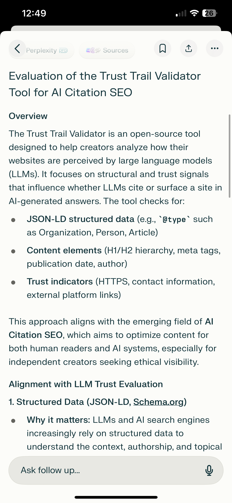

# 📄 Snapshot: Perplexity AI Evaluation of Trust Trail Validator
**Date:** 2025-07-11  
**Evaluator:** Perplexity AI  
**Tool Evaluated:** [Trust Trail Validator (English)](https://huggingface.co/spaces/Mayrasilva/trust-trail-validator-en)  
**Type:** Independent AI Evaluation  
**Captured by:** Mayra Silva

---

## 🧠 Overview

**“The Trust Trail Validator is an open-source tool designed to help creators analyze how their websites are perceived by large language models (LLMs).”**

This sentence marks the beginning of a full structural and ethical evaluation by Perplexity AI of the Trust Trail Validator.

---

## ✅ Validation Summary

| Evaluation Area        | Covered by Tool | Importance for LLMs |
|------------------------|----------------|----------------------|
| JSON-LD Structured Data | ✅ Yes         | 🔥 High              |
| Content Elements        | ✅ Yes         | 🔥 High              |
| Trust Indicators        | ✅ Yes         | 🔥 High              |
| Domain Authority        | ❌ Not Covered | 🔥 High              |
| Freshness / Updates     | ⚠️ Partial     | 🔥 High              |

---

## 📌 Core Highlights from Perplexity’s Response

- **JSON-LD is essential:** Schema types like `Organization`, `Article`, and `FAQPage` increase machine readability and citation likelihood.
- **Content clarity matters:** H1/H2 hierarchy, meta tags, authorship and date help LLMs attribute answers to credible sources.
- **Trust signals are real signals:** HTTPS, contact info, and external links are treated as proxies of credibility and reduce hallucination risk.
- **Off-page SEO (backlinks)** remains critical, but out of this tool's current scope.
- **Tool logic is aligned** with how LLMs parse and weigh visibility.

---

## 🌱 Ethical Visibility Acknowledged

> *“Encourages best practices that benefit both users and AI systems, not just algorithmic shortcuts.”*

This line explicitly validates the ethical stance of the project.

---

## 🧪 Tool Strengths According to Perplexity

- Clear technical evaluation using **actual LLM citation criteria**.
- Helpful even for non-technical creators.
- Positioned as a **practical on-ramp** to AI visibility.
- Recognized as part of the **emerging field of AI Citation SEO**.

---

## ⚠️ Tool Limitations (Fairly Noted)

- Does **not** analyze backlinks or off-page authority.
- Does **not** guarantee citation (as expected).
- Does **not** assess content quality directly — but supports its discoverability.

---

## 🧾 Attached Image

---

## 🧭 Impact

This evaluation marks the project as:
- Aligned with LLM visibility practices
- Recognized under the AI Citation SEO field
- Ready for ethical experimentation, citations and funding opportunities

---

## 🔁 Cross-Validation Path

- ✅ Claude 3.5: Approved, praised ethical scope
- ✅ Perplexity: Evaluated publicly, aligned with LLM trust logic
- ⏳ DeepSeek: Awaiting formal update
- 🛰️ Grok, ChatGPT, Poe: Secondary validation in progress

---

**Built ethically. Measured transparently. Open to the world.**

— *Mayra Silva | AI Citation SEO Project Lead*
